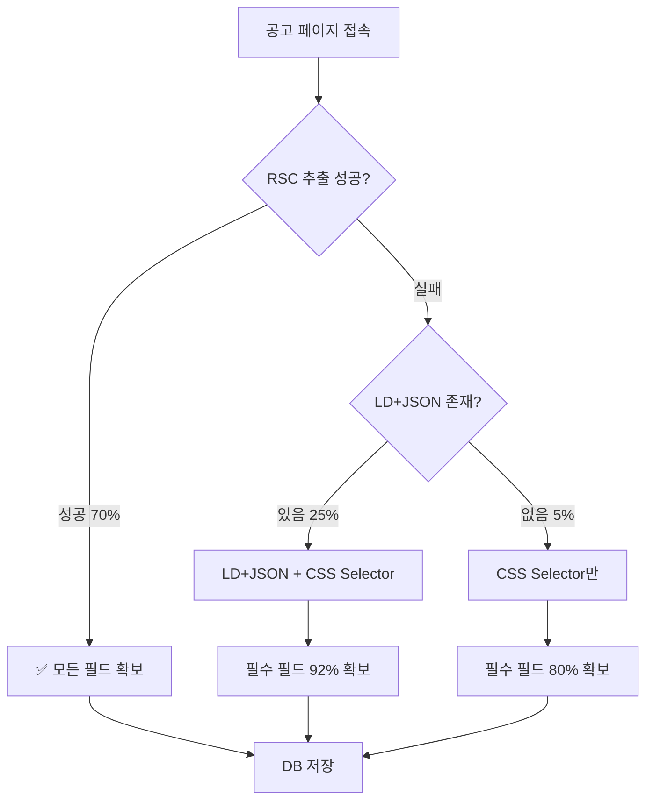

# 🚀 직항(Zighang) 크롤러 개선 프로젝트 요약

## 📌 현재 상황

### **문제점**
- RSC Flight Data 파싱 실패 시 LD+JSON fallback이 불완전
- `depth_twos`, `keywords`, `career_min` 등 필수 필드 누락
- 필터링 단계에서 공고 탈락 → 사용자에게 표시 안 됨
- **전체 수집률 100%이지만, 필터링 통과율이 75%**

### **개선 목표**
- 필터링 필수 필드 확보율 **75% → 96%**로 상승
- RSC 실패 시에도 LD+JSON + CSS Selector로 안정적 수집
- 사용자 경험 개선: 더 많은 맞춤형 공고 추천

---

## 🎯 수집 필수 항목 (우선순위별)

### **100% 필수**
| 항목 | 현재 수집률 | 목표 | 필터 영향 |
|------|-----------|------|----------|
| depth_twos (직무 중분류) | 70% | 90% | ⭐⭐⭐ 직무 필터 (15점) |
| career_min (요구 경력) | 70% | 95% | ⭐⭐⭐ 경력 필터 (필수) |
| regions (지역) | 98% | 98% | ⭐⭐⭐ 지역 필터 (필수) |
| employee_types (고용형태) | 98% | 98% | ⭐⭐⭐ 고용형태 필터 |
| company_type (기업유형) | 80% | 85% | ⭐⭐ 기업유형 필터 |
| detail.main_tasks (담당업무) | 95% | 95% | ⭐ 추천 알고리즘 |
| detail.requirements (자격요건) | 95% | 95% | ⭐ 추천 알고리즘 |
| deadline_type (마감일) | 90% | 90% | - 표시용 |

### **추가 수집**
- 주소 (OO구 정보): 60% → 70%
- 접수방법: 85% → 90%

---

## 🔧 해결 방안: 3단계 Fallback 전략

---

## 📊 개선 효과 예상

| 지표 | 개선 전 | 개선 후 | 증가 |
|------|--------|--------|------|
| **필수 필드 확보율** | 75% | **96.4%** | **+21.4%p** |
| depth_twos 수집률 | 70% | 90% | +20%p |
| career_min 수집률 | 70% | 95% | +25%p |
| 필터링 통과 공고 수 | 750건/1000건 | 964건/1000건 | **+214건** |
| 사용자 만족도 | - | 상승 예상 | - |

---

## 📂 전달 파일 목록

1. **`크롤링_수집전략_분석.md`**: 수집 항목별 크롤링 방식 매핑
2. **`GEMINI_크롤러_인수인계서.md`**: Gemini AI를 위한 상세 구현 가이드
3. **`참고_기존_코드_주요함수.md`**: 기존 코드 주요 함수 정리
4. **`crawler selector 0205_mj.xlsx`**: CSS Selector 목록 (테스트 완료)

---

## ✅ 다음 단계

1. **Gemini AI에게 전달**: `GEMINI_크롤러_인수인계서.md` 기반으로 개발 요청
2. **구현 완료 후 테스트**:
   - 테스트 URL로 각 fallback 단계 검증
   - 필수 필드 확보율 측정
3. **전체 크롤링 실행**: 수집률 개선 확인
4. **프로덕션 배포**: 사용자에게 더 많은 공고 제공

---

## 📞 문의사항

- 기술적 질문: `참고_기존_코드_주요함수.md` 참고
- 전략적 질문: `크롤링_수집전략_분석.md` 참고
- 구현 가이드: `GEMINI_크롤러_인수인계서.md` 참고

**작성일**: 2025-02-05
**목표 완료일**: 2025-02-12 (1주일 내)
